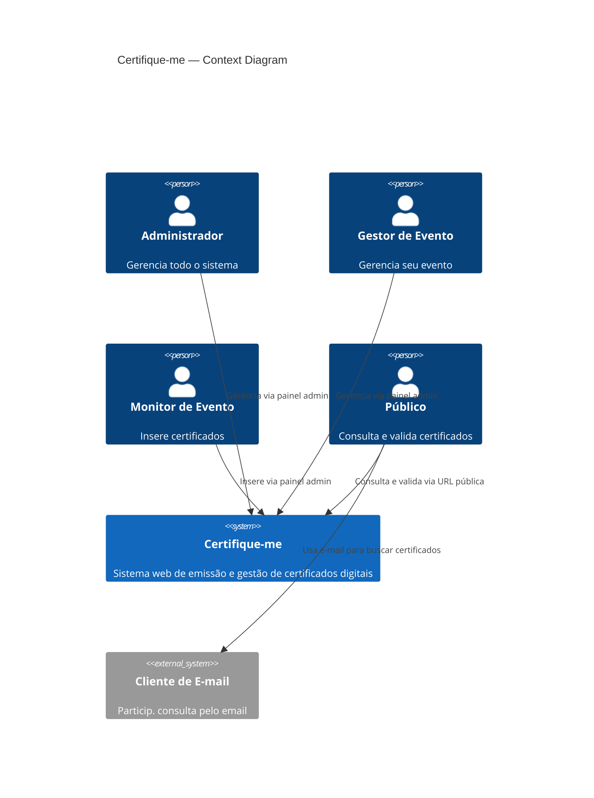
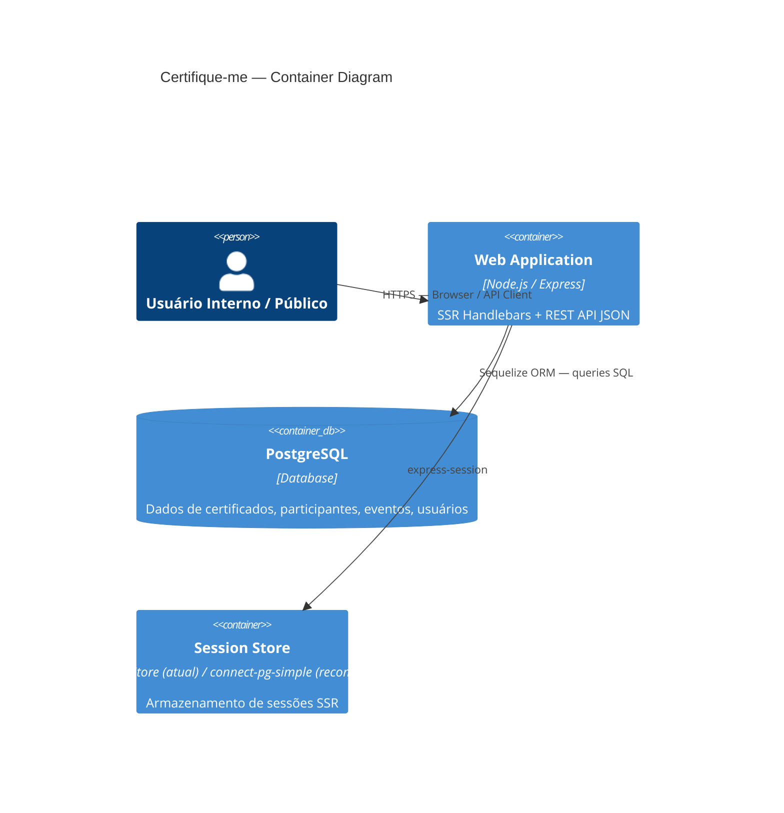
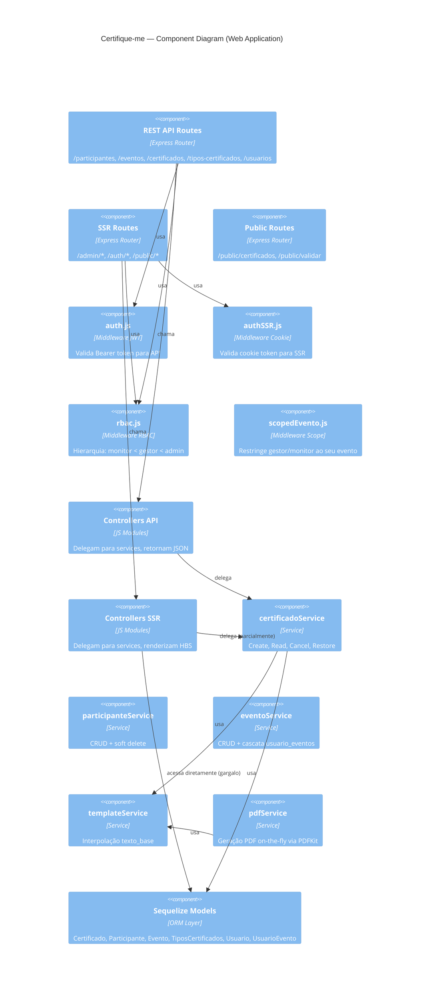

# Auditoria Técnica 05 — Certifique-me

**Data:** 2026-04-11  
**Horário:** 15:13 (BRT)  
**Auditor:** Arquiteto Sênior (GitHub Copilot)  
**Escopo:** Segunda auditoria profunda — estado pós-implementação da Auditoria 04  
**Foco:** Problemas reais, lacunas funcionais, UX técnica, integridade de dados e evolução arquitetural

---

## Sumário Executivo

O sistema evoluiu substancialmente desde a arquitetura inicial. A separação em camadas (routes → controllers → services → models) está presente, autenticação JWT + SSR está funcional, RBAC hierárquico está implementado, e o ciclo completo de emissão de certificados está operacional.

Porém, a auditoria identifica **dois bugs críticos com impacto direto em produção**, quatro problemas de integridade de dados, inconsistências sérias de UX no painel admin e dívida técnica acumulada que compromete escalabilidade.

---

## ETAPA 1 — Revisão Arquitetural (Estado Real)

### Arquitetura Atual

```
Browser/Cliente
    │
    ├── SSR (Handlebars)     ← /admin/*, /auth/*, /public/pagina/*
    │       │
    │       └── authSSR (cookie) → rbac → SSRControllers → Services → Sequelize → PostgreSQL
    │
    └── JSON API             ← /participantes, /eventos, /certificados, etc.
            │
            └── auth (JWT Bearer) → rbac → Controllers → Services → Sequelize → PostgreSQL
```

**Pontos que evoluíram:**

- Migrations versionadas (DONE)
- Autenticação JWT + cookie-based (DONE)
- RBAC hierárquico com `roles.indexOf` (DONE)
- Soft delete (paranoid) em todas as entidades (DONE)
- Services com lógica de negócio isolada (DONE)
- Relação N:N usuario_eventos (DONE)
- Templates com interpolação (DONE)
- PDF on-the-fly (DONE)
- Fluxo público sem autenticação (DONE)

### Sinais de Crescimento Desorganizado

**Problema 1 — Bypass da camada de service nos controllers SSR**

`certificadoSSRController.js` acessa modelos Sequelize diretamente em várias funções, contornando a camada de service:

```javascript
// ❌ Acesso direto ao modelo dentro de um controller SSR
const certificados = await Certificado.findAll({ where, include: INCLUDES })
const arquivados  = await Certificado.findAll({ paranoid: false, ... })
```

Enquanto isso, `certificadoService.js` existe mas só é chamado para `create`, `update`, `cancel`, `restore` e `delete`. A função `findAll` do service não é usada pelo SSR controller.

**Problema 2 — `destroy()` vs `delete()` com comportamentos divergentes**

Em `eventoService.js`:

```javascript
async destroy(id) {          // ← NÃO remove UsuarioEvento
  return evento.destroy()
},
async delete(id) {           // ← remove UsuarioEvento (cascata)
  await evento.destroy()
  await UsuarioEvento.destroy({ where: { evento_id: id } })
}
```

Dois métodos com semânticas diferentes, sem documentação. Se o controller chamar `destroy()` em vez de `delete()`, as associações ficam órfãs silenciosamente.

**Problema 3 — `require()` inline dentro de funções**

Em `eventoService.js`:

```javascript
async delete(id) {
  ...
  const { UsuarioEvento } = require('../../src/models')  // ← require inline
}
```

Além de ser anti-pattern (o módulo é cacheado, mas a intenção é obscura), o path `../../src/models` de dentro de `src/services/` é semanticamente confuso.

**Problema 4 — Código de debug em produção**

Em `pdfService.js`, linha 14:

```javascript
console.log('PDFService certificado:', certificado)
```

Este log vaza dados de certificados (incluindo dados pessoais) para stdout em produção.

---

## ETAPA 2 — Revalidação vs. Sistema Base (Google Sheets)

O sistema base foi inacessível (404 no GitHub), mas com base nas especificações e nas auditorias anteriores, os seguintes pontos merecem atenção:

### Funcionalidades Implementadas Incompletamente

**1. Verificação de duplicata no sistema base**  
O sistema base com Google Sheets usava a estrutura da planilha como barreira natural contra duplicatas (linha única por combinação). O sistema atual **não replica esta garantia** via constraint de banco.

**2. Geração de código — contador com soft delete**  
O sistema atual conta certificados `WHERE evento_id AND tipo_certificado_id` para gerar o incremental, mas não inclui deletados (`paranoid: true` no Sequelize). Cenário crítico:

- Emite certificado EDU-25-PT-1
- Soft-deleta esse certificado
- Emite novo certificado → também gera EDU-25-PT-1 (colisão no campo única `codigo`)
- Sequelize lança erro de constraint, mas a mensagem exposta ao usuário é genérica

**3. Não há campo `carga_horaria` em tipos de certificados**  
Certificados acadêmicos frequentemente registram horas de atividade. O sistema base possivelmente incluía essa informação. A especificação não define, mas é uma lacuna funcional relevante.

---

## ETAPA 3 — Problemas Funcionais Críticos

### 3.1 CERTIFICADOS DUPLICADOS (CRÍTICO — Risco de Produção)

#### Diagnóstico completo

**Ausência de constraint composta no banco:**

A migration `20260311180841-create-certificados.js` cria apenas um índice UNIQUE em `codigo`. Não existe nenhum constraint em:

```
(participante_id, evento_id, tipo_certificado_id)
```

Isso significa que o mesmo participante pode receber **N certificados do mesmo tipo no mesmo evento** sem nenhuma barreira técnica.

**Race condition no gerador de código:**

```javascript
// certificadoService.js — create()
const count = await Certificado.count({
  // ← lê
  where: { evento_id, tipo_certificado_id },
})
const incremental = count + 1 // ← calcula
data.codigo = `${eventCode}-${year}-${tipoCode}-${incremental}`
return Certificado.create(data) // ← escreve
```

Entre `count` e `create`, outro request pode executar o mesmo `count`, obter o mesmo valor e tentar inserir o mesmo `codigo`. O UNIQUE em `codigo` captura isso com erro de constraint — mas:

1. A mensagem de erro para o usuário é genérica
2. O usuário pode tentar novamente e o segundo request terá um count diferente e terá sucesso — criando duplicata de (participante, evento, tipo) mesmo que o código seja único

**Soft delete agrava o problema:**

O `count` usa `paranoid: true` (default), então certificados deletados **não são contados**. Ao restaurar um certificado, é possível ter dois registros ativos com `status=emitido` para o mesmo (participante, evento, tipo).

#### Proposta de Solução

**Nível de banco — nova migration:**

```javascript
// migrations/YYYYMMDDHHMMSS-add-unique-constraint-certificados.js
module.exports = {
  async up(queryInterface) {
    await queryInterface.addConstraint('certificados', {
      fields: ['participante_id', 'evento_id', 'tipo_certificado_id'],
      type: 'unique',
      name: 'uq_certificados_participante_evento_tipo',
      where: { deleted_at: null }, // índice parcial: só ativo
    })
  },
  async down(queryInterface) {
    await queryInterface.removeConstraint(
      'certificados',
      'uq_certificados_participante_evento_tipo',
    )
  },
}
```

> **Nota:** PostgreSQL suporta índices parciais (`WHERE deleted_at IS NULL`). Isso permite que um certificado cancelado/deletado não "ocupe" a vaga.

**Nível de aplicação — verificação antes de criar:**

```javascript
// certificadoService.js — create()
async create(data) {
  // Verificação de duplicata ANTES de calcular código
  const existe = await Certificado.findOne({
    where: {
      participante_id: data.participante_id,
      evento_id: data.evento_id,
      tipo_certificado_id: data.tipo_certificado_id,
      // só verifica ativos (deleted_at é null por padrão com paranoid)
    },
  })
  if (existe) {
    const err = new Error(
      'Já existe um certificado ativo para este participante, evento e tipo.'
    )
    err.statusCode = 409
    throw err
  }
  // ... resto da lógica ...
}
```

**Geração de código — usar sequência atômica:**

```javascript
// Substitui o COUNT + 1 por uma query com FOR UPDATE ou sequência DB
const sequencia = await sequelize.query(
  `SELECT COALESCE(MAX(CAST(SPLIT_PART(codigo, '-', 4) AS INTEGER)), 0) + 1 AS next
   FROM certificados
   WHERE evento_id = :eventoId AND tipo_certificado_id = :tipoId`,
  {
    replacements: {
      eventoId: data.evento_id,
      tipoId: data.tipo_certificado_id,
    },
    type: sequelize.QueryTypes.SELECT,
  },
)
const incremental = sequencia[0].next
```

> Para escala maior, considerar uma sequência PostgreSQL dedicada por (evento, tipo).

**Dados já duplicados — strategy de limpeza:**

```sql
-- Identificar duplicatas existentes
SELECT participante_id, evento_id, tipo_certificado_id, COUNT(*),
       ARRAY_AGG(id ORDER BY created_at) AS ids
FROM certificados
WHERE deleted_at IS NULL
GROUP BY participante_id, evento_id, tipo_certificado_id
HAVING COUNT(*) > 1;

-- Manter o mais recente e cancelar os demais
UPDATE certificados SET status = 'cancelado'
WHERE id IN (
  SELECT id FROM (
    SELECT id, ROW_NUMBER() OVER (
      PARTITION BY participante_id, evento_id, tipo_certificado_id
      ORDER BY created_at DESC
    ) AS rn
    FROM certificados WHERE deleted_at IS NULL
  ) ranked WHERE rn > 1
);
```

---

### 3.2 DUPLICAÇÃO DE FEEDBACK UI (Bug Confirmado)

#### Diagnóstico

O problema é estrutural e afeta **múltiplas páginas** simultaneamente.

**Causa raiz:** `views/layouts/admin.hbs` já renderiza flash globalmente:

```handlebars
{{! admin.hbs }}
{{#if flash.success}}
  {{#each flash.success}}
    <div class='alert alert-success'>{{this}}</div>
  {{/each}}
{{/if}}
```

E as views individuais também renderizam flash localmente com sintaxe diferente:

```handlebars
{{! certificados/index.hbs, usuarios/index.hbs, tipos-certificados/index.hbs }}
{{#if flash.success}}<div
    class='alert alert-success'
  >{{flash.success}}</div>{{/if}}
```

**Páginas afetadas:**

- `admin/certificados/index.hbs` — flash duplicado
- `admin/usuarios/index.hbs` — flash duplicado
- `admin/tipos-certificados/index.hbs` — flash duplicado

**Por que o layout já deveria ser suficiente?** O `connect-flash` drena a mensagem na primeira leitura. Porém, em `app.js`, o middleware popula `res.locals.flash` logo após o `flash()`:

```javascript
app.use((req, res, next) => {
  res.locals.flash = {
    success: req.flash('success'), // ← consome o flash aqui
    error: req.flash('error'), // ← e aqui
  }
  next()
})
```

Como `res.locals.flash` é um objeto em memória, ao ser acessado tanto no layout quanto na view, o **mesmo objeto** é referenciado duas vezes → duas renderizações da mensagem.

#### Solução

Remover os blocos de flash das views individuais. O layout já é responsável por isso. As views **não devem** renderizar flash próprio, exceto se houver necessidade de contexto específico (ex: flash inline dentro de formulário de edição).

---

## ETAPA 4 — Auditoria de UX Técnica (Admin)

### 4.1 BUG ESTRUTURAL — Tabela de Certificados

**Em `admin/certificados/index.hbs`, o botão "Remover" está no `<td>` de Status, não de Ações:**

```handlebars
<td>
  <span class='badge ...'>{{status}}</span>
  {{! ❌ Este form está no lugar ERRADO }}
  <form
    method='POST'
    action='/admin/certificados/{{id}}/deletar'
    class='d-inline'
    ...
  >
    <button type='submit' class='btn btn-sm btn-danger'>Remover</button>
  </form>
</td>
<td>
  <a href='...' class='btn btn-sm btn-info'>Ver</a>
  <a href='...' class='btn btn-sm btn-secondary'>Editar</a>
  {{#unless (eq status 'cancelado')}}
    <button ... class='btn btn-sm btn-warning'>Cancelar</button>
  {{/unless}}
</td>
```

Resultado visual: a coluna "Status" exibe o badge + botão vermelho, enquanto a coluna "Ações" fica apenas com Ver/Editar/Cancelar. O "Remover" está fora do local esperado pelo usuário.

### 4.2 Inconsistência de Padrão de Ações

Diferentes páginas usam diferentes verbos e cores para ações semelhantes:

| Página         | Ação destrutiva | Cor/Label                  |
| -------------- | --------------- | -------------------------- |
| Certificados   | Soft delete     | `btn-danger` + "Remover"   |
| Participantes  | Soft delete     | `btn-danger` + "Remover"   |
| Eventos        | Soft delete     | `btn-danger` + "Remover"   |
| Usuários       | Soft delete     | `btn-warning` + "Arquivar" |
| Tipos de Cert. | Soft delete     | `btn-warning` + "Arquivar" |

Mesma operação (soft delete), três labels diferentes, duas cores diferentes. O usuário admin não consegue prever o comportamento esperado.

**Proposta de padrão unificado:**

```
Ações não-destrutivas:  btn-outline-primary  (Ver/Detalhe)
Ações de edição:        btn-outline-secondary (Editar)
Ações de aviso:         btn-outline-warning   (Cancelar — reversível com aviso)
Ações destrutivas:      btn-outline-danger    (Arquivar/Remover — sempre com confirmação)
Ações de restauração:   btn-outline-success   (Restaurar)
```

**Com ícones FontAwesome (recomendado):**

```html
<a href="..." class="btn btn-sm btn-outline-primary" title="Ver detalhes">
  <i class="fa fa-eye"></i>
</a>
<a href="..." class="btn btn-sm btn-outline-secondary" title="Editar">
  <i class="fa fa-pencil"></i>
</a>
<button ... class="btn btn-sm btn-outline-danger" title="Arquivar">
  <i class="fa fa-archive"></i>
</button>
```

### 4.3 Ausência de Paginação nas Listagens SSR

**Todas as listagens do painel admin** usam `findAll()` sem limite:

- `certificadoSSRController.index` → `Certificado.findAll()`
- `participanteSSRController.index` → `Participante.findAll()`
- `eventoSSRController` → não verificado, mas provavelmente idêntico

Com 10.000 certificados, o servidor carregaria todos para renderizar a página. Isso é uma bomba de tempo.

### 4.4 Ausência de Busca em Certificados e Eventos

- `admin/participantes` → tem busca `?q=` ✅
- `admin/certificados` → tem filtros por evento/status/tipo, mas **sem busca por nome ou código** ❌
- `admin/eventos` → sem busca ❌
- `admin/usuarios` → sem busca ❌

### 4.5 Dashboard — Métricas Insuficientes

O dashboard atual exibe apenas 4 contadores estáticos (admin) ou 2 (gestor/monitor) sem nenhum dado contextual ou operacional.

**O que falta e tem alto valor prático:**

```
Admin:
  ├── [EXISTE] Total de Eventos
  ├── [EXISTE] Total de Tipos
  ├── [EXISTE] Total de Participantes
  ├── [EXISTE] Total de Usuários
  ├── [FALTA] Total de Certificados emitidos
  ├── [FALTA] Certificados emitidos hoje / esta semana
  ├── [FALTA] Certificados por status (emitido/pendente/cancelado) — gráfico pizza
  ├── [FALTA] Top 5 eventos por certificados emitidos
  └── [FALTA] Últimos 5 certificados criados (tabela resumida)

Gestor/Monitor:
  ├── [EXISTE] Total de Certificados (seus eventos)
  ├── [EXISTE] Total de Participantes (seus eventos)
  ├── [FALTA] Certificados por tipo no seu evento
  └── [FALTA] Últimas atividades (log de ações recentes)
```

### 4.6 Navbar Admin — Problemas

**Problemas identificados:**

1. Sem ícones — puramente textual
2. Sem classe `active` no item atual
3. "Tipos" como label truncado — confuso em navbar estreita
4. Sem separador visual entre grupos (navegação vs. conta do usuário)
5. Sem link para a área pública (`/public/pagina/opcoes`)

**Proposta de reorganização:**

```
[Logo] Certifique-me Admin
  ├── Dashboard (ícone: home)
  ├── Certificados (ícone: award)
  ├── Participantes (ícone: users)
  ├── --- [separador apenas admin/gestor] ---
  ├── Eventos (ícone: calendar)           [admin + gestor]
  ├── Tipos de Certificados (ícone: tag)  [admin + gestor]
  └── Usuários (ícone: user-cog)          [admin only]
                                   [Área Pública] [Nome (perfil)] [Sair]
```

### 4.7 admin/certificados — Detalhe de Problema de Escopo

`certificadoSSRController.index()` faz a filtragem por eventoIds do gestor/monitor **sem paginação**. Para um evento com 5.000 certificados, o gestor recebe responsa com todos os 5.000 registros.

---

## ETAPA 5 — Validação de Modelagem de Dados

### Constraints Ausentes

| Tabela               | Constraint Ausente                                                                | Risco                    |
| -------------------- | --------------------------------------------------------------------------------- | ------------------------ |
| `certificados`       | UNIQUE (participante_id, evento_id, tipo_certificado_id) WHERE deleted_at IS NULL | CRÍTICO                  |
| `certificados`       | Sem índice em `tipo_certificado_id`                                               | MÉDIO (consultas lentas) |
| `tipos_certificados` | UNIQUE em `codigo` — OK ✅                                                        | —                        |
| `eventos`            | UNIQUE em `codigo_base` — OK ✅                                                   | —                        |
| `participantes`      | UNIQUE em `email` — OK ✅                                                         | —                        |
| `usuarios`           | UNIQUE em `email` — OK ✅                                                         | —                        |

### Problema de Integridade Referencial com Soft Delete + FK CASCADE

A migration de `certificados` define:

```javascript
participante_id: {
  references: { model: 'participantes', key: 'id' },
  onDelete: 'CASCADE'
}
```

Com paranoid (soft delete), um participante nunca é hard-deleted pelo Sequelize. Porém, se for feito un hard delete manual no banco (ex: via psql em produção), os certificados seriam **deletados em cascata permanentemente**, sem possibilidade de restore.

**Recomendação:** Mudar `onDelete: 'RESTRICT'` para entidades que usam soft delete. Só deve ser `CASCADE` se o hard delete for intencional e os filhos não precisam ser preservados.

### Ausência de campo `carga_horaria` em `tipos_certificados`

Certificados de eventos acadêmicos tipicamente exigem carga horária. Atualmente só existe como campo em `dados_dinamicos` (JSONB livre), o que torna relatórios e consultas mais difíceis.

---

## ETAPA 6 — Avaliação de Sessões (Redis vs. Alternativas)

### Situação Atual

```javascript
// app.js
app.use(
  session({
    secret: sessionSecret,
    resave: false,
    saveUninitialized: false,
  }),
)
```

**MemoryStore (default do express-session)** — sem configuração de store explícita. Isso significa:

- Sessões vivem **apenas na memória do processo Node.js**
- Ao reiniciar o servidor → **todas as sessões são perdidas** (todos os usuários deslogados)
- Com múltiplos processos (PM2 cluster) → sessões não são compartilhadas entre workers
- Vaza memória com muitos usuários simultâneos (a own library avisa disso em `NODE_ENV=production`)

### Redis — Quando faz sentido?

**Faz sentido usar Redis quando:**

- A aplicação roda em múltiplas instâncias (horizontal scaling)
- Sessões precisam persistir após restart
- Alta concorrência com muitos usuários simultâneos

**É overengineering quando:**

- Aplicação roda em instância única
- Poucos usuários simultâneos (< 100)
- Redis seria uma dependência extra sem benefício imediato

### Recomendação para este sistema

**Use `connect-pg-simple` — sem dependências novas.**

O PostgreSQL já está presente. Usar o mesmo banco para sessões é a decisão com menor complexidade operacional:

```javascript
const pgSession = require('connect-pg-simple')(session)

app.use(
  session({
    store: new pgSession({
      conString: process.env.DATABASE_URL,
      tableName: 'user_sessions',
      pruneSessionInterval: 60 * 15, // limpa sessões expiradas a cada 15 min
    }),
    secret: sessionSecret,
    resave: false,
    saveUninitialized: false,
    cookie: {
      maxAge: 30 * 24 * 60 * 60 * 1000, // 30 dias
      secure: process.env.NODE_ENV === 'production',
      httpOnly: true,
      sameSite: 'lax',
    },
  }),
)
```

**Upgrade para Redis:** Considerar apenas se houver necessidade de múltiplas instâncias ou se a carga de usuários simultâneos justificar.

**JWT puro (sem sessão):** Viável, mas exige implementação de refresh token e revogação (token blacklist), o que adiciona complexidade similar ao Redis.

---

## ETAPA 7 — Architecture Stress Test

### Cenário 1: Múltiplos admins simultâneos

**Problema:** Cada operação de listagem (admin/certificados) carrega **todos os certificados** sem limite. Com 3 admins abrindo a página simultaneamente em um evento grande, serão feitas 3 queries `SELECT * FROM certificados` sem paginação, cada uma retornando potencialmente milhares de linhas.

**Impacto:** Spike de memória no processo Node, possível timeout.

### Cenário 2: Alta criação de certificados simultânea

O fluxo de criação executa:

1. `TiposCertificados.findByPk`
2. `Evento.findByPk`
3. Validação de campos (loop)
4. `Certificado.count`
5. `Certificado.create`

São 5 queries sequenciais sem transaction. Em concorrência:

- Queries 1-3: safe (reads)
- Queries 4-5: **race condition** (count + insert não atômico)

### Cenário 3: Integridade sob carga

Com a ausência de constraint única composta, em alta carga:

- Dois operadores podem criar certificados para o mesmo participante/evento/tipo
- Ambos recebem sucesso (códigos distintos, porém dados duplicados)
- O banco não rejeita

### Cenário 4: Expansão de funcionalidades

A ausência de testes de controller SSR (apenas controllers JSON têm testes) significa que expansões futuras do painel admin serão difíceis de testar e refatorar com segurança.

---

## ETAPA 8 — Gargalos Arquiteturais Reais

### G1 — Controllers SSR com lógica de negócio (MÉDIO)

`certificadoSSRController.index()` implementa filtragem por eventos do usuário diretamente:

```javascript
async function getEventoIds(req) {
  if (req.usuario.perfil === 'admin') return null
  const associacoes = await UsuarioEvento.findAll({
    where: { usuario_id: req.usuario.id },
  })
  return associacoes.map((a) => a.evento_id)
}
```

Essa lógica de "filtrar por escopo do usuário" é necessária em TODOS os controllers SSR e deveria estar no middleware `scopedEvento` ou ser extraída para um helper de serviço.

### G2 — findAll sem limite (ALTO)

```javascript
// ❌ Em todos os SSR controllers
const certificados = await Certificado.findAll({ where, include: INCLUDES })
```

Sem `limit`. Deve ser paginado.

### G3 — N queries para renderizar a página de listagem de certificados

A cada acesso a `/admin/certificados`:

1. `UsuarioEvento.findAll` (escopo)
2. `Certificado.findAll` (ativos)
3. `Certificado.findAll` (arquivados)
4. `Evento.findAll` (para filtro)
5. `TiposCertificados.findAll` (para filtro)

= **5 queries por page load** para um admin, **6** para gestor/monitor.

### G4 — `require()` inline e acoplamento entre layers

`eventoSSRController` provavelmente usa `require('../services/eventoService')` corretamente, mas `eventoService.delete()` faz `require('../../src/models')` internamente — acoplamento circular de facto.

### G5 — authSSR com código de teste misturado em produção

```javascript
// authSSR.js
if (process.env.NODE_ENV === 'test' && req.headers['x-mock-user']) {
  // mock de teste
}
if (process.env.NODE_ENV === 'test' && req.session?.mockUser) {
  // mock de teste
}
```

Lógica de teste está no middleware de autenticação de produção. Isso é um risco de segurança se a variável `NODE_ENV` for incorretamente configurada.

---

## ETAPA 9 — Dívida Técnica Classificada

### ALTO RISCO

| #     | Problema                                                       | Arquivo                     | Impacto                           |
| ----- | -------------------------------------------------------------- | --------------------------- | --------------------------------- |
| DT-01 | Sem constraint única (participante, evento, tipo) → duplicatas | `migrations/`               | Dados corrompidos                 |
| DT-02 | Race condition na geração de código                            | `certificadoService.js:L63` | Erros silenciosos em concorrência |
| DT-03 | MemoryStore em sessão (sem persistência, sem compartilhamento) | `app.js`                    | Usuários deslogados no restart    |
| DT-04 | Flash message duplicada em múltiplas páginas                   | `admin.hbs` + views         | UX quebrada                       |
| DT-05 | Botão "Remover" no `<td>` errado na tabela de certificados     | `certificados/index.hbs`    | UX confusa                        |
| DT-06 | `console.log` com dados pessoais em pdfService                 | `pdfService.js:L14`         | Violação LGPD/OWASP A09           |

### MÉDIO RISCO

| #     | Problema                                              | Arquivo                       | Impacto                          |
| ----- | ----------------------------------------------------- | ----------------------------- | -------------------------------- |
| DT-07 | findAll sem limite em todos os SSR controllers        | múltiplos                     | Performance degradada com volume |
| DT-08 | destroy() vs delete() com semânticas divergentes      | `eventoService.js`            | Bugs silenciosos                 |
| DT-09 | Controllers SSR bypassam service layer em queries     | `certificadoSSRController.js` | Manutenibilidade                 |
| DT-10 | Código de teste em middleware de produção (`authSSR`) | `authSSR.js`                  | Risco de segurança               |
| DT-11 | `onDelete: 'CASCADE'` em entidades com soft delete    | migrations                    | Risco de hard delete acidental   |
| DT-12 | `require()` inline dentro de funções de service       | `eventoService.js`            | Legibilidade e testabilidade     |

### BAIXO RISCO

| #     | Problema                                                | Arquivo                           | Impacto                          |
| ----- | ------------------------------------------------------- | --------------------------------- | -------------------------------- |
| DT-13 | Sem classe `active` na navbar admin                     | `admin.hbs`                       | UX mínima                        |
| DT-14 | Labels inconsistentes ("Remover" vs "Arquivar")         | várias views                      | Confusão no usuário              |
| DT-15 | templateService `require()` dentro de função de detalhe | `certificadoSSRController.js:L68` | Estilo                           |
| DT-16 | Sem índice em `certificados.tipo_certificado_id`        | migrations                        | Consultas mais lentas com volume |
| DT-17 | Sem busca full-text em certificados ou eventos          | views                             | Usabilidade                      |

---

## ETAPA 10 — Melhorias Concretas por Prioridade

### CRÍTICAS (fazer agora)

**C1 — Adicionar constraint única composta em certificados**

```
Migration: ADD UNIQUE (participante_id, evento_id, tipo_certificado_id) WHERE deleted_at IS NULL
Service: Verificação de duplicata antes de criar
```

**C2 — Corrigir botão "Remover" na tabela de certificados**  
Mover o `<form>` de deletar do `<td>` de status para o `<td>` de ações.

**C3 — Remover flash duplicado das views**  
Apagar blocos `{{#if flash.success}}` das views individuais. O layout já cuida disso.

**C4 — Remover `console.log` de dados do pdfService**  
Substituir por logging estruturado ou remover.

**C5 — Trocar MemoryStore por connect-pg-simple**

---

### IMPORTANTES

**I1 — Adicionar paginação nas listagens SSR**  
`Certificado.findAll` → `Certificado.findAndCountAll({ limit: 20, offset })` em todos os controllers.

**I2 — Eliminar código de mock do authSSR de produção**  
Extrair para um middleware separado carregado apenas em ambiente de teste.

**I3 — Unificar destroy/delete em eventoService**  
Renomear para `softDelete` (com cascata) e remover o alias `destroy` público.

**I4 — Remover require() inline em eventoService**

**I5 — Adicionar busca por nome/código na listagem de certificados**

**I6 — Adicionar índice em `certificados.tipo_certificado_id`**

```javascript
await queryInterface.addIndex('certificados', ['tipo_certificado_id'], {
  name: 'idx_certificados_tipo_certificado_id',
})
```

---

### OPCIONAIS

**O1 — Enriquecer dashboard com métricas operacionais**  
Últimos 5 certificados, gráfico por status, atividade recente.

**O2 — Adicionar ícones na navbar (FontAwesome CDN)**

**O3 — Classe `active` na navbar com base na URL atual**

**O4 — Adicionar `carga_horaria` como campo nativo em TiposCertificados**

**O5 — Tooltip de acessibilidade nos botões de ação**

---

## ETAPA 11 — Exemplos de Implementação

### 11.1 Paginação nos Controllers SSR (incremental, sem quebrar sistema)

```javascript
// certificadoSSRController.js — index()
const page = Math.max(1, parseInt(req.query.page) || 1)
const perPage = 20
const offset = (page - 1) * perPage

const { count, rows: certificados } = await Certificado.findAndCountAll({
  where,
  include: INCLUDES,
  limit: perPage,
  offset,
  order: [['created_at', 'DESC']],
})

return res.render('admin/certificados/index', {
  // ...props existentes...
  certificados,
  paginacao: {
    total: count,
    page,
    perPage,
    totalPages: Math.ceil(count / perPage),
  },
})
```

```handlebars
{{! no template: paginação simples }}
{{#if paginacao.totalPages}}
  <nav>
    <ul class='pagination pagination-sm'>
      {{#if (gt paginacao.page 1)}}
        <li class='page-item'>
          <a
            class='page-link'
            href='?page={{dec paginacao.page}}&...'
          >Anterior</a>
        </li>
      {{/if}}
      <li class='page-item disabled'>
        <span class='page-link'>{{paginacao.page}}
          /
          {{paginacao.totalPages}}</span>
      </li>
      {{#if (lt paginacao.page paginacao.totalPages)}}
        <li class='page-item'>
          <a
            class='page-link'
            href='?page={{inc paginacao.page}}&...'
          >Próxima</a>
        </li>
      {{/if}}
    </ul>
  </nav>
{{/if}}
```

### 11.2 Verificação de Duplicata + Erro Tratado (certificadoService)

```javascript
async create(data) {
  // 1. Verificar duplicata (antes de qualquer IO desnecessário)
  const duplicata = await Certificado.findOne({
    where: {
      participante_id: data.participante_id,
      evento_id: data.evento_id,
      tipo_certificado_id: data.tipo_certificado_id,
    },
  })
  if (duplicata) {
    const err = new Error(
      'Já existe um certificado ativo para este participante neste evento e tipo.'
    )
    err.statusCode = 409
    err.code = 'DUPLICATE_CERTIFICADO'
    throw err
  }

  const tipo = await TiposCertificados.findByPk(data.tipo_certificado_id)
  if (!tipo) {
    const err = new Error('Tipo de certificado não encontrado')
    err.statusCode = 404
    throw err
  }
  // ... resto da lógica existente ...
}
```

### 11.3 Remover código de mock do authSSR (separação de responsabilidades)

```javascript
// src/middlewares/authSSR.js — versão limpa (produção)
const jwt = require('jsonwebtoken')
const { Usuario } = require('../models')

module.exports = async function authSSR(req, res, next) {
  const token = req.cookies?.token
  if (!token) {
    req.usuario = null
    res.locals.usuario = null
    if (req.originalUrl.startsWith('/admin')) {
      return res.redirect('/auth/login')
    }
    return next()
  }
  try {
    const decoded = jwt.verify(token, process.env.JWT_SECRET)
    const usuario = await Usuario.findByPk(decoded.id)
    if (!usuario) {
      if (req.originalUrl.startsWith('/admin'))
        return res.redirect('/auth/login')
      return next()
    }
    const usuarioData = {
      id: usuario.id,
      nome: usuario.nome,
      perfil: usuario.perfil,
      isAdmin: usuario.perfil === 'admin',
      isGestor: usuario.perfil === 'gestor',
    }
    req.usuario = usuarioData
    res.locals.usuario = usuarioData
    next()
  } catch {
    if (req.originalUrl.startsWith('/admin')) return res.redirect('/auth/login')
    next()
  }
}

// tests/middlewares/authSSR.mock.js — SEPARADO e só carregado em testes
module.exports = function authSSRMock(req, res, next) {
  if (req.headers['x-mock-user']) {
    req.usuario = JSON.parse(req.headers['x-mock-user'])
    res.locals.usuario = req.usuario
    return next()
  }
  if (req.session?.mockUser) {
    req.usuario = req.session.mockUser
    res.locals.usuario = req.usuario
    return next()
  }
  next()
}
```

### 11.4 connect-pg-simple para sessões persistentes

```bash
npm install connect-pg-simple
```

```javascript
// app.js
const pgSession = require('connect-pg-simple')(session)

app.use(
  session({
    store: new pgSession({
      conString: process.env.DATABASE_URL,
      tableName: 'user_sessions',
      pruneSessionInterval: 900, // segundos
    }),
    secret: sessionSecret,
    resave: false,
    saveUninitialized: false,
    cookie: {
      maxAge: 8 * 60 * 60 * 1000, // 8 horas
      httpOnly: true,
      secure: process.env.NODE_ENV === 'production',
      sameSite: 'strict',
    },
  }),
)
```

---

## ETAPA 12 — Evolução Arquitetural

### Curto Prazo (organização interna — sem alterar contrato externo)

1. **Fixar DT-01 a DT-06** (todos os críticos)
2. Adicionar paginação SSR (DT-07)
3. Unificar nomenclatura destroy/delete (DT-08)
4. Mover lógica de escopo de evento para helper isolado
5. Adicionar busca por nome/código em certificados
6. Substituir MemoryStore por connect-pg-simple

### Médio Prazo (robustez e operabilidade)

1. **Dashboard operacional** com métricas reais (últimos certificados, por status, por tipo)
2. Paginação cursor-based para listagens grandes (substitui offset paginado)
3. Logging estruturado (winston/pino) com redaction de dados pessoais
4. Extração da lógica de "escopo por evento" para service/helper reutilizável
5. Testes de integração cobrindo SSR controllers
6. Índice em `tipo_certificado_id` na tabela certificados

### Longo Prazo (escala e extensibilidade)

1. **Sessões com connect-pg-simple** → **Redis** quando houver múltiplas instâncias
2. Job assíncrono para geração de PDF (fila leve com `bull` ou `pg-boss` usando o Postgres existente)
3. Sistema de auditoria/logs de ações (quem criou/cancelou qual certificado e quando)
4. Exportação em lote (CSV/ZIP de PDFs por evento)
5. Internacionalização (i18n) para suporte a múltiplos idiomas nos templates de texto

---

## ETAPA 13 — C4 Model Atualizado

### Context Diagram



### Container Diagram



### Component Diagram — Web Application



---

## Priorização Final

| Prioridade | Item                                                | Esforço | Impacto       |
| ---------- | --------------------------------------------------- | ------- | ------------- |
| 🔴 P0      | DT-01: Constraint única composta + migration        | Baixo   | Crítico       |
| 🔴 P0      | DT-02: Verificação de duplicata no service          | Baixo   | Crítico       |
| 🔴 P0      | DT-04: Flash duplicado nas views                    | Baixo   | Alto          |
| 🔴 P0      | DT-05: Botão Remover no lugar errado (certificados) | Baixo   | Alto          |
| 🔴 P0      | DT-06: Remover console.log de dados pessoais        | Trivial | Segurança     |
| 🟡 P1      | DT-03: Trocar MemoryStore por connect-pg-simple     | Médio   | Médio         |
| 🟡 P1      | DT-07: Paginação nos SSR controllers                | Médio   | Alto          |
| 🟡 P1      | DT-10: Extrair mock do authSSR                      | Médio   | Segurança     |
| 🟢 P2      | O1: Dashboard operacional com métricas              | Alto    | Médio         |
| 🟢 P2      | O2/O3: Ícones e active state na navbar              | Baixo   | Baixo         |
| 🟢 P3      | O5: Logging estruturado                             | Médio   | Operabilidade |
